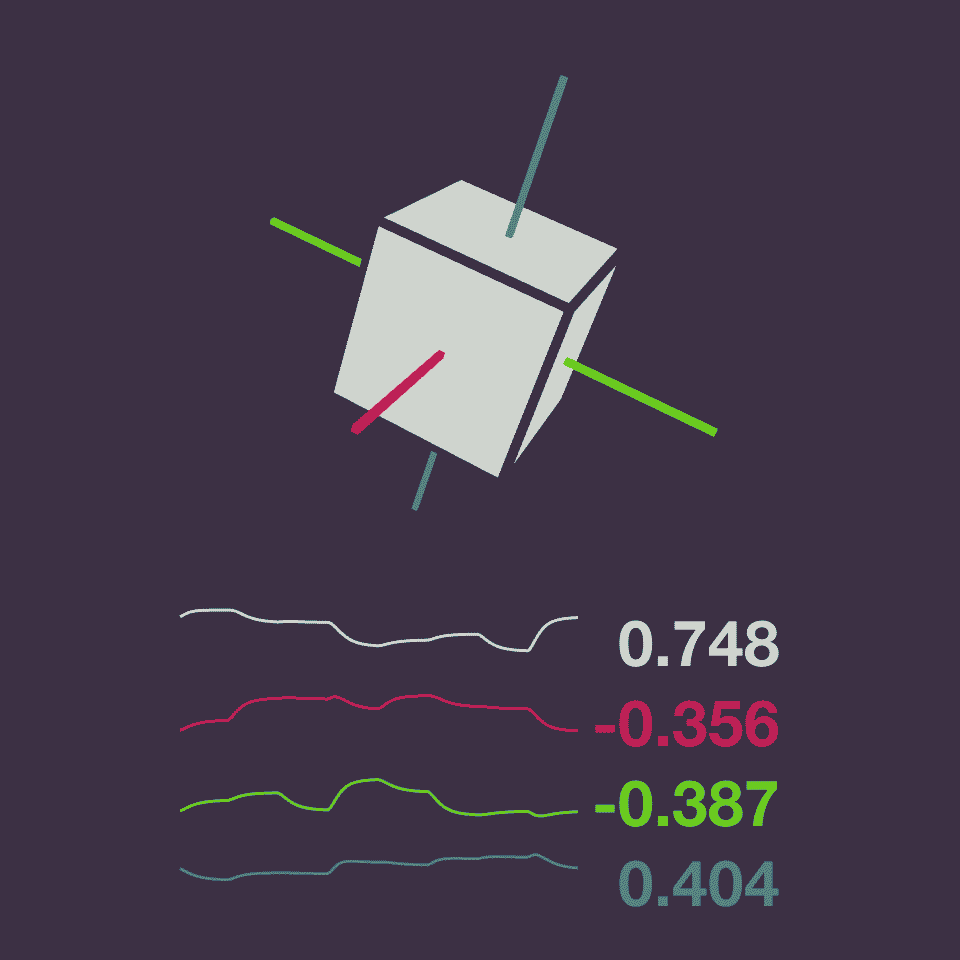

# Everyday One Motion - 20160818  

"Quaternion"  

  

Processing  

[Everyday One Motion](http://motions.work/motion/366)  

## Quaternion

今回はクオータニオンですね。  
クオータニオンは日本語では四元数と呼び、３次元空間において物体の回転を表すのに用いることができます。  
クオータニオンの実装は、 [wgld.org](https://wgld.org/d/webgl/w031.html) を参考にさせていただきました。  

画面下のグラフは、上から順番にクオータニオンの `w`, `x`, `y`, `z` 成分を表しています。  
見てわかるように、意味が分かりません。  
今回このアニメーションを作ってわかったことはクオータニオンはわからないということです。  

## クオータニオンと行列

クオータニオンは位置づけとしては行列と似ています。  
例えば、行列同士で掛け算ができるように、クオータニオン同士でも掛け算ができ、それぞれが持つ変換を直感的に掛け合わせることができます。  
しかし、行列とクオータニオンは要素数が違い、できることにも差があります。以下にクオータニオンと行列の比較テーブルを示します。  

|.|クオータニオン|行列（3x3）|行列（4x4）|
|:---|:---|:---|:---|
|要素数|4|9|16|
|回転|✓|✓|✓|
|拡大・縮小|✗|✓|✓|
|平行移動|✗|✗|✓|
|料金（月額）|無料|無料|無料|
